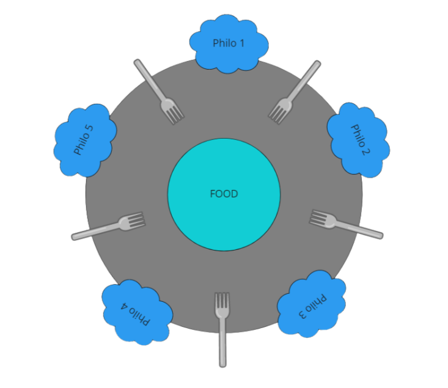

# # Philosophers
I’ve never thought philosophy would be so deadly.

# Introduction 
In this project, you will learn the basics of threading a process. You will
learn how to make threads. You will discover the mutex.

# Description
Several philosophers are sitting at a round table doing one of three things: eating, thinking, or sleeping. While eating, they are not thinking or sleeping, while sleeping, they are not eating or thinking and of course, while thinking, they are not eating or sleeping. The philosophers sit at a circular table with a large bowl of spaghetti in the center. There are some forks on the table, it is assumed that a philosopher must eat with two forks, one for each hand. The philosophers must never be starving and every philosofer needs to eat. Philosophers don’t speak with each other and don’t know when another philosopher is about to die. Each time a philosopher has finished eating, he will drop his forks and start sleeping. When a philosopher is done sleeping, he will start thinking. The simulation stops when a philosopher dies. If the number of times each philosopher must eat is specified the simulation stop when all philos eat the count time specified.

______
# How use

```
Compile the executable with `make`.
execute:
./philo number_of_philos time_to_die time_to_eat time_to_sleep [number_of_times_each_philosopher_must_eat]
```
______


